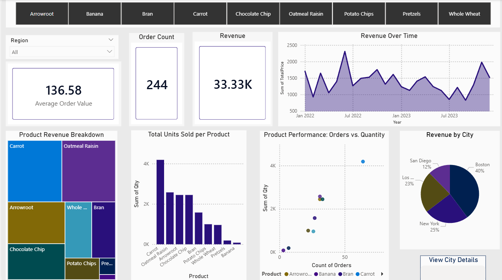
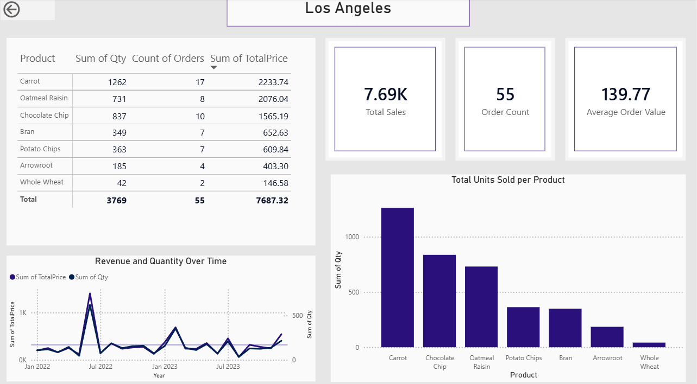

# Interactive Sales Dashboard

An interactive dashboard for exploring sales performance across products, cities, and metrics.

## Overview
This dashboard allows users to dynamically filter and compare sales metrics, supporting exploratory analysis and data-driven decision-making. It’s designed to surface patterns that may be hidden in static reports.

## Dashboard Preview

## Data
The dataset, sourced from Context, includes transactional sales information: product, city, revenue, order volume, and units sold. 
## Features
- Filter by product and city  
- Track multiple metrics: revenue, orders, and units sold  
- Comparative views across products and locations  

## Business Value
- **Sales & Marketing:** Identify strong and weak product performance by city  
- **Operations:** Understand demand patterns across locations  
- **Management:** Quickly assess performance without custom reports  

## Key Insight
Product performance varies across cities and metrics. Interactive filtering helps uncover patterns that static views may miss.

> **Note:** Insights from this dashboard are exploratory and may require further validation for high-impact decisions.
